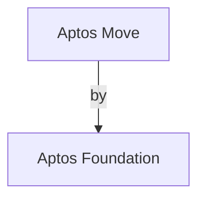
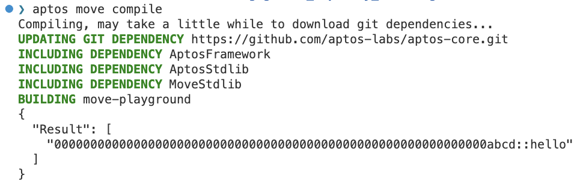

# Aptos

<p align="left">
  
</p>

Learn everything Aptos Blockchain and the way Move language is used in it.

> The same knowledge can be replicated for other Move based blockchains with little tweaking.

## Overview

For Move language, refer to main [README](../README.md).



## Installation

### Aptos CLI

[Source](https://aptos.dev/tools/install-cli/install-from-brew)

**Install**:

```sh
brew update        # Gets the latest updates for packages
brew install aptos # Installs the Aptos CLI
```

**Upgrade**:

```sh
brew update        # Gets the latest updates for packages
brew upgrade aptos # Upgrades the Aptos CLI
```

Check if the installation is successful:

```sh
❯ aptos                                                                                                                         ⏎
aptos 2.0.1
Aptos Labs <opensource@aptoslabs.com>
Command Line Interface (CLI) for developing and interacting with the Aptos blockchain

USAGE:
    aptos <SUBCOMMAND>

OPTIONS:
    -h, --help       Print help information
    -V, --version    Print version information

SUBCOMMANDS:
    account       Tool for interacting with accounts
    config        Tool for interacting with configuration of the Aptos CLI tool
    genesis       Tool for setting up an Aptos chain Genesis transaction
    governance    Tool for on-chain governance
    help          Print this message or the help of the given subcommand(s)
    info          Show build information about the CLI
    init          Tool to initialize current directory for the aptos tool
    key           Tool for generating, inspecting, and interacting with keys
    move          Tool for Move related operations
    multisig      Tool for interacting with multisig accounts
    node          Tool for operations related to nodes
    stake         Tool for manipulating stake and stake pools
    update        Update the CLI itself
```

### [Language server](../README.md#language-server)

### Editor

VSCode extensions (updated frequently):

#### [Move syntax highlighter](../README.md#move-syntax-highlighter)

#### Aptos Move-analyzer

<!-- TODO: -->

### SDKs

#### Typescript

`aptos-core/ecosystem/typescript/sdk`

#### Python

`aptos-core/ecosystem/python/sdk`

#### Unity

#### Rust

Source: `aptos-core/sdk`

## Architecture

## Getting Started

1. Init a project via `$ aptos move init --name hello`. It creates - `sources/` folder & `Move.toml` file
2. Write a Move program in a file `hello.move`

   ```move
   module hello_address:: hello {
       struct PersonID has key {
           id: u32,
       }

       public entry fun set_val(account: &signer, value: u32) {
           move_to(account, PersonID {id: value})
       }
   }
   ```

3. Compile via `$ aptos move compile`
   

   - Observations

     - binaries: `hello.move`, `hello.mv` in `build/<package-name>/` folder
     - dependencies:

       ```
       dependencies:
         - AptosFramework
         - AptosStdlib
         - MoveStdlib
       ```

4. Test

   - Can be added into the contract file or can be written in a separate file with `_test` suffix. E.g. `hello_test.move`
   <!-- TODO: Add test example -->

5. Deploy

 <!-- TODO: Add deploy example -->

## [Tutorials](https://github.com/aptos-labs/aptos-core/blob/main/aptos-move/move-examples/move-tutorial)

## Concepts & Coding

Here are the concepts and related coding snippets.

### Network

- Block explorers:
  - [Aptos explorer](https://explorer.aptoslabs.com/)
- block time: **5s** [Source](https://forum.aptoslabs.com/t/heres-a-thread-on-aptos-transaction-speed/228252)
- Max. TPS: **160k**. [Source](https://hacken.io/discover/aptos-blockchain-101-everything-you-need-to-know-about-aptos-chain/)
- parallel processing
- Chain type: L1
- scalability solution: Sharding. Aptos also uses a technology called sharding, which allows the blockchain to be divided into smaller segments called shards. Each shard can process transactions independently, which means that multiple transactions can be processed simultaneously, further increasing transaction speed. [Source](https://forum.aptoslabs.com/t/heres-a-thread-on-aptos-transaction-speed/228252)
- Consensus algorithm: Proof of Stake (PoS) (with BFT).
- Node types: full, light
- **Mainnet**
  - chain ID: 1
  - rest_url: "https://fullnode.mainnet.aptoslabs.com"
- **Testnet**
  - chain ID: 2
  - rest_url: "https://fullnode.testnet.aptoslabs.com"
  - faucet_url: "https://faucet.testnet.aptoslabs.com"
- **Devnet**
  - chain ID: 63
  - rest_url: "https://fullnode.devnet.aptoslabs.com"
  - faucet_url: "https://faucet.devnet.aptoslabs.com"

### Account

- each has 32 bytes address
- each has a sequence number
- account creation:
  - with funding (funded by the caller). E.g. EOSIO accounts,
  - without funding (just creates the account). Like in Ethereum.
- each account has an _address_, _public key_, _private key_.


```yaml
# generate during profile init or can be generated via `aptos account create`
profiles:
  default:
    private_key: "0x629e73f4629fdc625e321f730bfcc98748b2b60839418687d8252b6f2f2be782"
    public_key: "0xf3d2ea99f5943a56cba66da0fea789ecfeba975850482287407f483d051eb9ab"
    account: 77d7118d5e17f56cfbb3910a77f03aaeaed43e39027976fb170ab43ba2c179c4
    rest_url: "https://fullnode.devnet.aptoslabs.com"
    faucet_url: "https://faucet.devnet.aptoslabs.com"
```

---

[Source](https://github.com/aptos-labs/aptos-core/blob/9785520d1d5dca168aa464fb82414e147da0689e/sdk/src/types.rs#L23-L36)

```rust
/// LocalAccount represents an account on the Aptos blockchain. Internally it
/// holds the private / public key pair and the address of the account. You can
/// use this struct to help transact with the blockchain, e.g. by generating a
/// new account and signing transactions.
#[derive(Debug)]
pub struct LocalAccount {
    /// Address of the account.
    address: AccountAddress,
    /// Authentication key of the account.
    key: AccountKey,
    /// Latest known sequence number of the account, it can be different from validator.
    sequence_number: u64,
}
```

### Coin (Fungible Token)

- APT is the native currency (or protocol coin) of the blockchain.
- Lowest unit: Octa (Octas)
- Highest unit: APT (Aptos)
- Decimal places or precision: 8 i.e. `1 APT = 1e8 Octas`
- There is a Coin client which is used to transfer coins between accounts.

```rust
// source: https://github.com/aptos-labs/aptos-core/blob/9785520d1d5dca168aa464fb82414e147da0689e/sdk/src/coin_client.rs#L25-L29
#[derive(Clone, Debug)]
pub struct CoinClient<'a> {
    api_client: &'a ApiClient,
}
```

```rust
// source: https://vscode.dev/github/aptos-labs/aptos-core/blob/main/sdk/examples/transfer-coin.rs#L84-L88
let txn_hash = coin_client
    .transfer(&mut alice, bob.address(), 1_000, None)
    .await
    .context("Failed to submit transaction to transfer coins")?;
```

- transfer options:

```rust
/// Source: https://github.com/aptos-labs/aptos-core/blob/9785520d1d5dca168aa464fb82414e147da0689e/sdk/src/coin_client.rs#L93-L105
pub struct TransferOptions<'a> {
    pub max_gas_amount: u64,

    pub gas_unit_price: u64,

    /// This is the number of seconds from now you're willing to wait for the
    /// transaction to be committed.
    pub timeout_secs: u64,

    /// This is the coin type to transfer.
    pub coin_type: &'a str,
}
```

And the default implementation is as follows:

```rust
impl<'a> Default for TransferOptions<'a> {
    fn default() -> Self {
        Self {
            max_gas_amount: 5_000,
            gas_unit_price: 100,
            timeout_secs: 10,
            coin_type: "0x1::aptos_coin::AptosCoin",
        }
    }
}
```

> NOTE: So, by default the coin is Aptos Coin. But we can change it to any other coin by defining explicitly.

### NFT (Non-Fungible Token)

[Tutorial](https://github.com/aptos-labs/aptos-core/tree/main/aptos-move/move-examples/mint_nft)

### Transaction

A transaction builder is used to create a transaction. It is a builder pattern.

```rust
// function to create a transaction builder
fn transaction_builder(&self, payload: TransactionPayload) -> TransactionBuilder {
    TransactionBuilder {
        sender: None,
        sequence_number: None,
        payload,
        max_gas_amount: self.max_gas_amount,
        gas_unit_price: self.gas_unit_price,
        expiration_timestamp_secs: self.expiration_timestamp(),
        chain_id: self.chain_id,
    }
}
```

<details>
<summary><b>Usage:</b></summary>

```rust
//! Source: https://github.com/aptos-labs/aptos-core/blob/9785520d1d5dca168aa464fb82414e147da0689e/sdk/src/transaction_builder.rs
//! code snippet for
//! 1. create a transaction
//! 2. sign it
//! 3. submit it

// fetch the chain ID
let chain_id = self
    .api_client
    .get_index()
    .await
    .context("Failed to get chain ID")?
    .inner()
    .chain_id;

/// NOTE: `transfer` is an EntryFunction in the `coin` module at address `0x1`.
/// Here, `TypeTag` indicates which coin to transfer. The same `0x1::coin` module's `transfer`
/// function is used by other coins as well
let transaction_builder = TransactionBuilder::new(
    TransactionPayload::EntryFunction(EntryFunction::new(
        ModuleId::new(AccountAddress::ONE, Identifier::new("coin").unwrap()),
        Identifier::new("transfer").unwrap(),
        vec![TypeTag::from_str(options.coin_type).unwrap()],
        vec![
            bcs::to_bytes(&to_account).unwrap(),
            bcs::to_bytes(&amount).unwrap(),
        ],
    )),
    SystemTime::now()
        .duration_since(UNIX_EPOCH)
        .unwrap()
        .as_secs()
        + options.timeout_secs,
    ChainId::new(chain_id),
)
.sender(from_account.address())
.sequence_number(from_account.sequence_number())
.max_gas_amount(options.max_gas_amount)
.gas_unit_price(options.gas_unit_price);

// create a signed transaction
let signed_txn = from_account.sign_with_transaction_builder(transaction_builder);

// submit the transaction
Ok(self
    .api_client
    .submit(&signed_txn)
    .await
    .context("Failed to submit transfer transaction")?
    .into_inner())
```

</details>

### Contract

- Language: Move
- VM: MoveVM
- Binary: `.mv`

---

**SC State Comparo between Move and Solidity**:


---

Each SC is a `module` which has EntryFunctions. Each EntryFunction is a public function which can be called from outside the module.

```move
module 0xCAFE::basic_coin {
    struct Coin has key {
        value: u64,
    }

    public entry fun mint(account: &signer, value: u64) {
        move_to(account, Coin { value })
    }
}
```

> Here, `0xCAFE` is the address of the module. `basic_coin` is the name of the module. The address can be abstracted away by a name (say `basic_coin_addr`).
>
> Now, add this `basic_coin_addr` to the `Move.toml` file as follows:

```toml
[addresses]
basic_coin_addr = "0xCAFE"
```

## Repositories

- [Aptos Core | Rust SDK](https://github.com/aptos-labs/aptos-core.git)
- [Move Examples by Aptos](https://github.com/aptos-labs/aptos-core/blob/main/aptos-move/move-examples)
  > More advanced examples are here. Real-world examples including NFT, DAO, DeFi, etc.
- [Move Tutorials by Aptos](https://github.com/aptos-labs/aptos-core/blob/main/aptos-move/move-examples/move-tutorial)
  > Start from here for learning Aptos Move SC development

## Troubleshooting

## Resources

- [Rust coding guidelines for Aptos Node implementation](https://aptos.dev/community/rust-coding-guidelines)
- [Move language by Aptos](https://aptos.dev/move/book/SUMMARY)
- [Aptos Developer Documentation](https://aptos.dev/)
- [Aptos Onboarding Tutorials](https://aptos.dev/tutorials/)
  > for beginners
