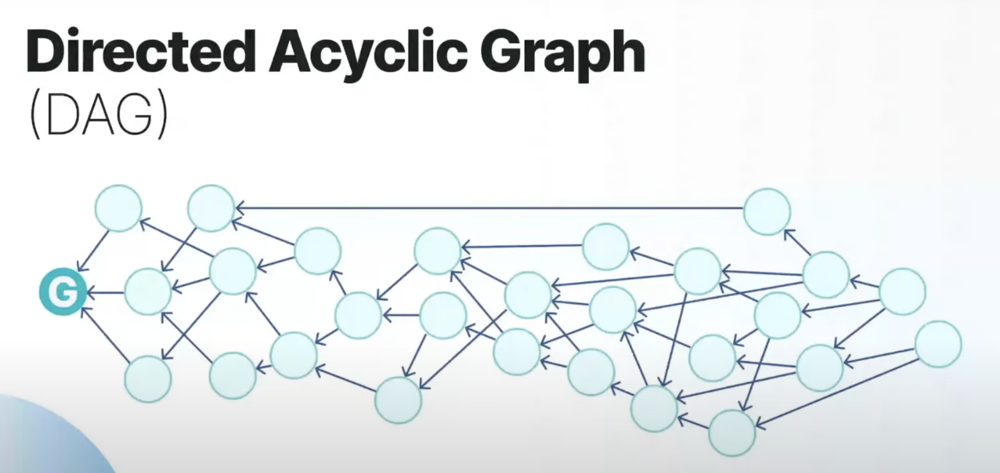
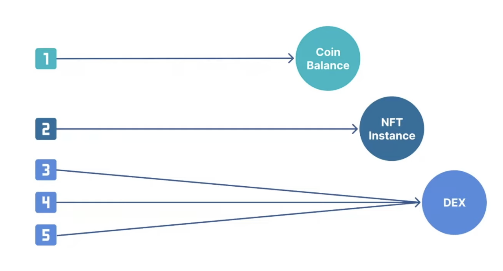

# Sui

<p align="left">
  
</p>

Learn everything Sui Blockchain and the way Move language is used in it.

> The same knowledge can be replicated for other Move based blockchains with little tweaking.

## Overview

- **Sui** is a blockchain network which uses Move language.
- Foundation name: **Mysten Labs**
- Sui was founded by Mysten Labs. Its five co-founders, as well as several Mysten employees, worked on developing the Diem blockchain and Move programming language. Four of the five co-founders worked at Facebook but [left](https://blockworks.co/four-former-facebook-developers-launch-web3-startup/) due to the strict regulatory restrictions in place and decided to work on their own blockchain.
- There has been some confusion that Mysten Labs is affiliated with Aptos, another Move-based blockchain, but the team has clarified that there is no relationship between the two projects except the fact that both teams have had prior experience at Facebook’s blockchain developments.
- Eventual consistency is the consensus model employed by Sui; if one honest validator certifies the transaction, all of the other honest validators will too eventually.
  > Almost by every blockchains that include finality.
- **Instant finality** for **simple** transactions (i.e. transactions that only involve owned objects) is achieved through multi-lane processing, which allows transactions to be processed in parallel. This means that the client receives confirmation of finality immediately, effectively removing the concept of a block time. **Complex** transactions (i.e. transactions that involve shared objects) require consensus and thus take longer (2-3s) to confirm.
- Sui provides these benefits to developers:
  - Sui Move and object-centric data model (enables composable objects/NFTs)
  - Asset-centric programming model
  - Easier developer experience
- Traditional blockchains totally order all client transactions with respect to each other. This design requires reaching consensus across validators, which is effective but slow.
- **Cons**: Building an efficient synchronizer is harder in Sui than in traditional blockchains. The synchronizer sub-protocol allows validators to update each other by sharing data, and it allows slow validators to catch up. Building an efficient synchronizer for traditional blockchains is no easy task, but still simpler than in Sui.

## Installation

1. Install [prerequisites](https://docs.sui.io/build/install#prerequisites) for your operating system (macOS).
2. [Install Sui binaries](https://docs.sui.io/build/install#install-sui-binaries).

   ```sh
   cargo install --locked --git https://github.com/MystenLabs/sui.git --branch devnet sui
   ```

   Check if the installation was successful:

   ```sh
    ❯ sui
    sui 1.5.0-5f0704aee
    Mysten Labs <build@mystenlabs.com>
    A Byzantine fault tolerant chain with low-latency finality and high throughput

    USAGE:
        sui <SUBCOMMAND>

    OPTIONS:
        -h, --help       Print help information
        -V, --version    Print version information

    SUBCOMMANDS:
        client              Client for interacting with the Sui network
        console             Start Sui interactive console
        fire-drill          Tool for Fire Drill
        genesis             Bootstrap and initialize a new sui network
        genesis-ceremony
        help                Print this message or the help of the given subcommand(s)
        keytool             Sui keystore tool
        move                Tool to build and test Move applications
        network
        start               Start sui network
        validator           A tool for validators and validator candidates
   ```

   > NOTE: `devnet` is the default network. You can install `testnet` or `mainnet` as well.

   To update to the latest stable version of Rust:

   ```sh
   rustup update stable
   ```

3. Configure an Integrated Development Environment (IDE).
   - Editor: VSCode
   - Language server/analyzer:
4. Request SUI test tokens to use on Sui Devnet or Sui Testnet networks.

## Getting Started

## Tutorials

## Concepts & Coding

### Architecture



At its core, Sui is a distributed ledger that stores a collection of <u>programmable objects that each has a globally unique ID</u>. Each object (owned or shared) is owned by a (at least) single address, and each address can own an arbitrary number of objects.

At a high-level, the Sui blockchain achieves great speed and scalability through optimization for simple transactions. This is done by making each transaction idempotent, meaning that transactions retain its end state no matter how many times it is repeated. This is especially important in blockchain and payment systems to protect from duplicated transactions, which may result in a recipient receiving a payment twice, for example.

Each transaction can be of 2 types:

- user-to-user
- asset manipulation

Asset/object types:

- **Owned**: can only be manipulated by the owner
- **Shared**: can be manipulated by more than one user

Simple transaction: a transaction that only involves owned objects gives the sender immediate confirmation of finality.
Complex transaction: a transaction that involves shared objects requires consensus and thus takes longer (2-3s) to confirm.

Sui uses this distinction to forgo consensus for owned objects, resulting in very low latency for simple transactions since the client receives confirmation of finality immediately, effectively removing the concept of a block time. This is achieved via multi-lane processing, which eliminates the need for transactions to wait for completion of a previous transaction. However, this also means that a sender can only send one transaction at a time.

On the other hand, Sui uses the Narwhal and Tusk DAG-based mempool and efficient BFT consensus for more complex transactions involving shared objects.

[Read more](https://docs.sui.io/learn/how-sui-works#architecture)

### Network

- Block explorers:
  - [Sui explorer](https://suiexplorer.com/)
  - [suiscan](https://suiscan.xyz/mainnet/home)
  - [oklink](https://www.oklink.com/sui)
- Block time: **0.55s**
- Finality time: **2-3s** for complex (with shared objects) transactions. **Immediate** for simple transactions (with owned objects).
- TPS: **297k**. [Source](https://blog.sui.io/sui-performance-update/)
- parallel processing
- Chain type: L1
- Consensus algorithm: Proof of Stake (PoS) (with BFT). Precisely [Narwhal](https://github.com/MystenLabs/sui/tree/main/narwhal) and [partially synchronous Bullshark](https://arxiv.org/pdf/2209.05633.pdf). Validators on the Sui network approve and execute transactions in **parallel** using Byzantine Consistent Broadcast with high throughput.
- Node types: full, light
- [JSON RPC API](https://docs.sui.io/sui-jsonrpc)
- [Faucet](https://docs.sui.io/testnet/build/faucet)
- **Mainnet**
  - chain ID:
  - rest_url: "https://fullnode.mainnet.sui.io:443"
  - faucet:
- **Testnet**
  - chain ID:
  - rest_url: "https://fullnode.testnet.sui.io:443"
- **Devnet**

  - chain ID: c42d763f
  - rest_url: "https://fullnode.devnet.sui.io:443"
  - faucet_url: "https://faucet.devnet.sui.io/gas"

  ```sh
  curl --location --request POST 'https://faucet.devnet.sui.io/gas' \
  --header 'Content-Type: application/json' \
  --data-raw '{
      "FixedAmountRequest": {
          "recipient": "<YOUR SUI ADDRESS>"
      }
  }'
  ```

- Wallet: Petra

### Account

- **keypair**: _public key_ (base64 format), _address_ (hexadecimal format), _secret recovery phrase_ (12 words by default, can be 12/15/18/24) are generated via `keytool`.

### Transaction

A transaction in **Sui** is a change to the blockchain. This may be a _simple_ transaction affecting only single-writer, single-address objects, such as minting an NFT or transferring an NFT or another token. These transactions may bypass the consensus protocol in Sui.



More _complex_ transactions affecting objects that are shared or owned by multiple addresses, such as asset management and other DeFi use cases, go through the Narwhal and Bullshark DAG-based mempool and efficient Byzantine Fault Tolerant (BFT) consensus.

---

**Transaction lifecycle**:

1. Validate the transaction (signature verification with the original message)
2. If the checks pass, the validator locks all owned-objects and signs the transaction bytes.
3. It then returns the signature (transaction hash) to the client.
4. The client repeats this process with multiple validators until it has collected signatures on its transaction from a quorum (majority i.e. 2/3), thereby forming a certificate.
   > Note that the process of collecting validator signatures on a transaction into a certificate and the process of submitting certificates can be performed in parallel. The client can simultaneously multicast transactions/certificates to an arbitrary number of validators.
   >
   > Alternatively, a client can outsource either or both of these tasks to a third-party service provider. This provider must be trusted for liveness (e.g., it can refuse to form a certificate), but not for safety (e.g., it cannot change the effects of the transaction, and does not need the user's secret key).

More on [certificates](https://docs.sui.io/learn/architecture/validators#certificates).

Transactions take objects as input and produce objects as output. More on [objects](https://docs.sui.io/learn/objects).

---

**causal order vs Total order**: This is mainly related to transaction sequencing. Here, if T1 --produces--> O1, T2 --produces--> O2, then T1 --precedes--> T2. This is called _total order_. But, most of the transactions are ordered causally (when there is no dependency between them).

In summary, for simple transactions (owned objects), _causal order_ is used and for complex transactions (shared objects), _total order_ is used.

### Contract

A smart contract is an object (called a Sui Move package), and these smart contracts manipulate objects on the Sui network:

- Sui Move Package
  - Sui Move Module
    - Sui Move Object

#### Module/Package

- A **package** can have multiple modules (in bytecode).
- A package when published is immutable can never be changed or removed.
- A package object can depend on other package objects that were previously published to the Sui ledger.
- Each package has an unique **ID**.
- Each module name has a unique **name**.
- A **module** can have multiple functions.

#### Script

#### Storage

- Basic unit: **object**, unlike other blockchains where the storage is key-value based.
- **Sui Move Object**: typed data governed by a particular **Sui Move module** from a **Sui Move package**.
- Each **object** value is a struct with fields that can contain _primitive_ types (e.g. integers, addresses), other objects, and non-object structs. Each object value:
  - is mutable and owned by an address at the time of its creation,
  - but can subsequently be frozen and become permanently immutable, or
  - be shared and thus become accessible by other addresses.

#### Function

#### Event

#### Error

```move
// Error codes
/// The `sender` and `recipient` of the two escrowed objects do not match
const EMismatchedSenderRecipient: u64 = 0;
/// The `exchange_for` fields of the two escrowed objects do not match
const EMismatchedExchangeObject: u64 = 1;
```

### Coin (Fungible Token)

- SUI is the native currency (or protocol coin) of the blockchain.
- Lowest unit: MIST
- Highest unit: SUI
- Decimal places or precision: 9 i.e. `1 SUI = 1e9 MIST`

### NFT (Non-Fungible Token)

### SDKs

- [Sui Framework Documentaton](https://github.com/MystenLabs/sui/tree/main/crates/sui-framework/docs)
- [Sui Typescript SDK (official)](https://github.com/MystenLabs/sui/tree/main/sdk/typescript)
- [Sui Typescript SDK (community)](https://github.com/scallop-io/sui-kit)
- [Sui Rust SDK (official)](https://github.com/MystenLabs/sui/tree/main/crates/sui-sdk) 🌟
- [Sui Golang SDK (community)](https://github.com/coming-chat/go-sui-sdk)
- [Sui Python SDK (community)](https://github.com/FrankC01/pysui)
- [Sui Java SDK (community)](https://github.com/GrapeBaBa/sui4j)
- [Sui Kotlin SDK (community)](https://github.com/cosmostation/suikotlin)
- [Sui C# SDK (community)](https://github.com/d-moos/SuiNet)
- [Sui Dart SDK(community)](https://github.com/mofalabs/sui)

## Repositories

- [Official project repo](https://github.com/MystenLabs/sui/)

## Troubleshooting

## [Glossary](https://docs.sui.io/learn/sui-glossary)

## Resources

- [Sui Whitepaper](https://github.com/MystenLabs/sui/blob/main/doc/paper/sui.pdf)
- [Sui Move by Example](https://examples.sui.io/index.html)
- [Sui Move Intro Course](https://github.com/sui-foundation/sui-move-intro-course)
- [Sui Developer Portal](https://sui.io/developers)
  > The site displays the Mainnet version of the documentation by default.
  > The content changes based on the network you select from the dropdown.
- [Developer cheatsheet](https://docs.sui.io/build/dev_cheat_sheet)
- [Sui SC Examples](https://github.com/MystenLabs/sui/tree/main/sui_programmability/examples)
- [Write Smart Contracts with Sui Move](https://docs.sui.io/build/move)
- [How Sui Differs from Other Blockchains](https://docs.sui.io/learn/sui-compared)

### Videos

- [Official YT channel](https://www.youtube.com/@Sui-Network)
- [Sui x KuCoin Summer Hackathon YT playlist](https://www.youtube.com/playlist?list=PL9t2y-BKvZBQxHNQRM85O23QCfMJ1y1hG)
  - [Introduction to Sui Network and Move](https://www.youtube.com/watch?v=cJwN3IhpLnQ&list=PL9t2y-BKvZBQxHNQRM85O23QCfMJ1y1hG&index=1) 🧑🏻‍💻
